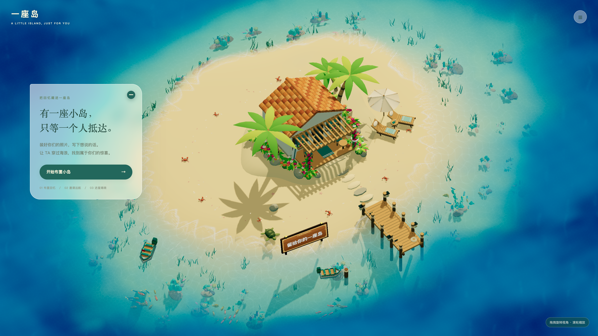
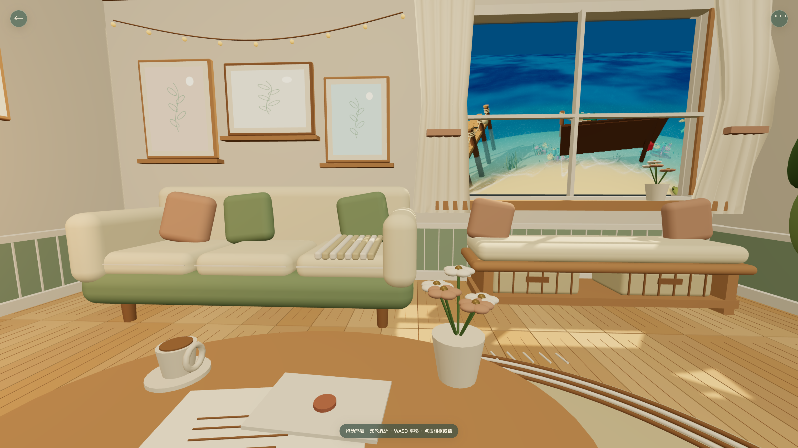
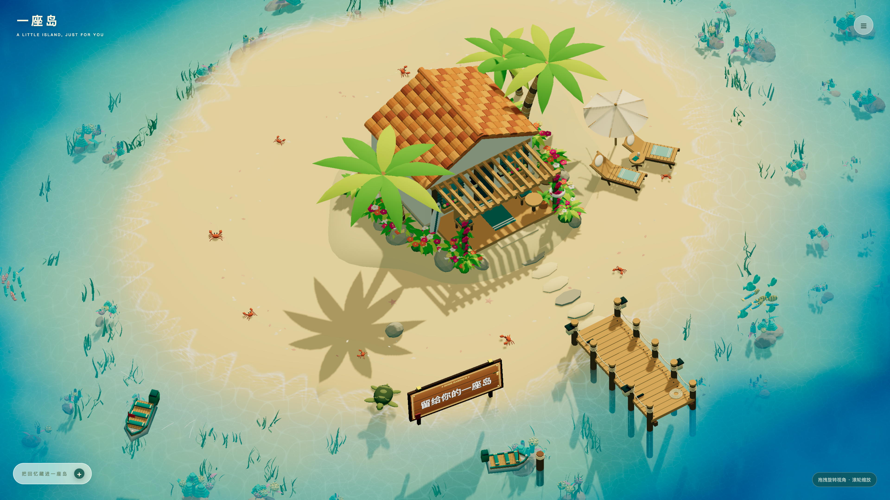
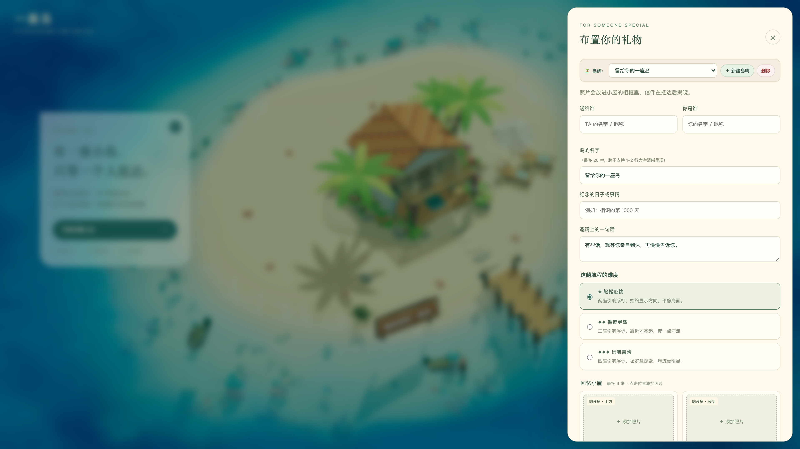

<div align="center">

# 🏝️ The Atoll · 岛屿与回忆

<p align="center">
  <strong>「 把回忆藏进一座岛，只等一个人抵达。」</strong><br>
  <em>Hide your memories inside a sun-drenched 3D island, waiting for someone special to arrive.</em>
</p>

<p align="center">
  <a href="https://island.fde.fan" target="_blank">
    
  </a>
  
  
  
  
</p>

<br>

<p align="center">
  
</p>

</div>

---

## 🌊 遇见一座岛 · About

> 每一座岛，都是一段不曾褪色的时光。<br>
> 你可以在这里布置专属的照片与信笺，刻下属于你们的岛屿名字；<br>
> 生成一份远航邀请函，让 TA 穿过蔚蓝海浪与斑斓鱼群，登岛走进小屋，亲手开启这份心意。

**The Atoll** 是一个基于 **Three.js** 和 **WebGL** 打造的高保真 3D 交互式海岛礼物空间。它融合了深度水体物理渲染、鱼群生态算法、第一人称 360° 全景漫步以及完整的「布置－邀请－启航－登岛－拆礼」浪漫体验。

<br>

<div align="center">

| 🏠 第一视角 360° 温馨小屋 | 🪵 码头招牌与碧海浅滩 |
| :---: | :---: |
|  |  |

| 🎁 岛屿管理与礼物布置 | 🌿 高通透毛玻璃与右上角收起 |
| :---: | :---: |
|  |  |

</div>

---

## ✨ 亮点特性 · Highlights

### 1. 🏡 第一人称 360° 沉浸式木屋
- **真实人眼视角漫步**：采用 1.62m 真实人眼高度与 72° 沉浸广角，身临其境置身温馨木屋室内。
- **360° 全景环顾与交互**：
  - 自由拖拽环顾四周，欣赏茶几上的咖啡杯、火漆信笺、花瓶与墙壁相框；
  - 支持键盘 `W / A / S / D` 在屋内自如走动，配备平滑边界碰撞约束；
  - 动态舷窗实时倒映窗外波光粼粼的无垠海景。

### 2. 🪵 码头招牌与个性化岛屿
- **个性化岛屿命名与多岛屿管理**：支持自定义岛屿名称（限 20 字），可自由新建与切换不同岛屿。
- **沙滩大字双行雕刻木牌**：招牌采用双行自适应排版与不受逆光阴影影响的明亮材质，在沙滩浪花边清晰可见。
- **专属远航邀请函**：以岛屿之名生成专属分享主标题与元数据，分享给最重要的 TA。

### 3. 🌿 现代毛玻璃 UI 交互
- **通透雅致的视觉设计**：卡片采用高透明度磨砂玻璃质感（`backdrop-filter: blur(16px)`），不遮挡澄澈碧蓝海面。
- **右上角绿色减号收起**：引导卡片右上角配备精致的绿色圆形收起按钮（`−`），收起后转为展开胶囊条，保持界面清爽。
- **极简无文字菜单**：首页右上角仅保留优雅半透明汉堡图标 `☰`，轻触弹出小屋预览、布置与反馈入口。

### 4. 🌊 次世代 WebGL 逼真海洋与生态
- **深度光线吸收与焦散**：随着海水深度渐变的多层吸光效果，阳光透过水面在珊瑚沙床投下灵动的动态焦散光斑（Caustics）。
- **生机勃勃的海底世界**：珊瑚花园之间穿梭着 4 种形态各异的热带鱼群（共 96 条群游鱼类），支持靠近散开、航行跟随与点击水面聚拢。
- **沙滩与海岸动态**：浅滩处裸露的细腻沙纹、海龟、贝壳与爬行小蟹，随风摇曳的棕榈树与热带花丛。

---

## 🎮 操作指南 · Controls

| 场景 | 操作方式 | 功能说明 |
| :--- | :--- | :--- |
| **海面航行** | `W / A / S / D` 或 `方向键` | 控制帆船前进、后退与转向 |
| | `Space` 空格键 | 紧急停船减速 |
| | 点击海面任意位置 | 自动驶向目标水域；吸引附近鱼群聚拢 |
| | 移动端虚拟方向盘 | 触屏一键无障碍驾驶 |
| **海岛俯瞰** | 鼠标左键拖拽 / 触屏滑动 | 360° 旋转观察岛屿与海浪 |
| | 鼠标滚轮 / 双指缩放 | 远近视角拉近与拉远 |
| **室内全景** | 鼠标拖拽 / 触屏滑动 | 360° 自由转头环顾室内四周 |
| | `W / A / S / D` | 在木屋室内自由漫步 |
| | 点击相框 / 信封 | 查看照片大图特写与信件全文 |

---

## 🛠️ 技术栈 · Tech Stack

- **核心渲染**：[Three.js](https://threejs.org/) (WebGL / GLTF / InstancedMesh / Custom Shader / RenderTarget)
- **前端构建**：[Vite](https://vitejs.dev/) · 原生现代 ES Modules · CSS3 磨砂玻璃（Frosted Glass）
- **资产管线**：Python · NumPy · Trimesh（程序化模型与地形生成）
- **数据持久化**：Supabase Postgres (JSONB 邀请存储) · Vercel Serverless Function
- **音频交互**：Web Audio API · MIDI 合成引擎

---

## 🚀 快速开始 · Quick Start

### 1. 克隆与安装

```bash
git clone https://github.com/tubban1/island.git
cd island
npm install
```

### 2. 本地开发

```bash
# 启动本地开发服务器
npm run dev

# 访问本地体验地址：http://127.0.0.1:5173
```

### 3. 构建与部署

```bash
# 运行单元测试
npm test

# 生产环境打包
npm run build

# 本地启动生产包预览
npm start
```

---

## 📁 目录结构 · Project Structure

```text
├── api/                    # Vercel Serverless Functions (礼物存储/反馈接口)
├── docs/                   # 视觉参考设计与文档截图
│   └── images/             # README 与展示用高保真图集
├── public/                 # 静态资源 (GLB 模型、Favicon、WebManifest)
├── src/
│   ├── gift-game.js        # 礼物流程主控制器 (创建、布置、邀请、交互)
│   ├── main.js             # 3D 场景引擎 (海洋着色器、鱼群算法、船只物理)
│   ├── memory-room.js      # 第一人称 360° 小屋全景与舷窗渲染管线
│   ├── gift.css            # 现代毛玻璃 UI 样式体系
│   └── gift-schema.js      # 礼物数据协议与校验逻辑
├── generate_assets.py      # 程序化模型生成脚本 (NumPy/Trimesh)
└── package.json
```

---

## 🌟 体验地址 · Live Demo

在线体验：👉 **[island.fde.fan](https://island.fde.fan)**

> *“愿你穿过海浪，找到属于你的岛屿。”*

---

<div align="center">
  <sub>Made with ❤️ and Three.js · Copyright © 2026 The Atoll Project</sub>
</div>
