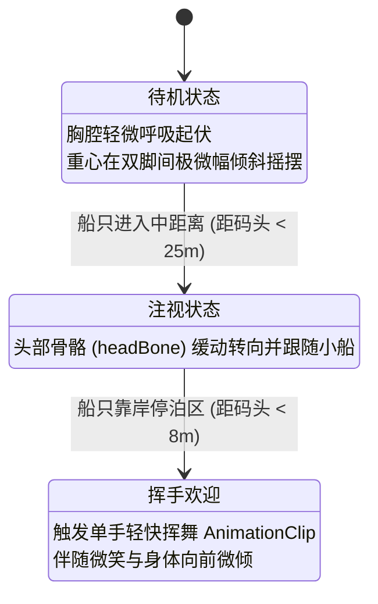

# 单图 3D Avatar 生成技术评估与落地方案（基线修正版）

> **文档定位**：真实工程基准与落地指南  
> **核心原则**：严谨工程推演、合规底线清晰、产品定位聚焦于 **“岛上专属 3D 手办（Personal Figurine）”** 而非“写实数字人”。

---

## 一、 关键指标对比与认知校正

| 评估维度 | 原乐观说法 | 实际工程与实测现状 | 本项目落地决策与基线规范 |
| :--- | :--- | :--- | :--- |
| **产品核心定位** | 单图 1:1 重建真人 | **❌ 过度承诺**。单图无法获取背面、发型后侧与褶皱细节，本质是先验推断。 | **定位于“Personal Figurine（专属 3D 手办）”**，重神态、发型轮廓与服装辨识度，不承诺 1:1 数字孪生。 |
| **依赖与开源属性** | 纯开源、无外部依赖 | **❌ 严重偏差**。依赖 PyTorch3D, CuPy, libmesh, libvoxelize，且需注册下载 SMPL-X/PIXIE。 | **定位为“重依赖链容器化管线”**，通过预制 Docker 镜像封装，非单体开箱即用库。 |
| **单次生成耗时** | 15～40 秒 | **⚠️ 过于激进**。官方公开基准耗时约 1.8 分钟（约 108 秒）。 | **工程目标设为 30～90 秒**；官方公开基线约 1.8 分钟，最终耗时以目标 GPU 平台实测为准。 |
| **用户等待体验** | 用户对 1 分钟容忍度极高 | **⚠️ 属于主观假设**。尚未经过真实用户测试检验。 | **产品假设**：礼物制作属于非实时创作流程，45～90 秒等待可能可接受；需通过真实用户测试验证。 |
| **后处理管线顺序** | 减面至 2 万面→骨骼挂载 | **🚨 拓扑破坏风险**。先粗暴减面会破坏与 SMPL-X 的几何对应与解算精度。 | **校正管线**：高模 Register SMPL-X 建立拓扑关联并生成权重 → 属性保真减面与权重传递 → GLB 导出。 |
| **压缩与格式优化** | KTX2/Meshopt 压缩 GLB | **⚠️ 概念混淆**。KTX2 与 Meshopt 面向完全不同的数据层。 | **分层压缩**：KTX2 / Basis Universal 压缩纹理（显存/贴图流）；Meshopt 压缩网格几何（顶点/索引/属性）。 |
| **骨骼与动画** | avatarizer 一键生成游戏模型 | **⚠️ 概念跳步**。avatarizer 是参数化形变，不等于游戏就绪的 SkinnedMesh。 | **标准资产转化**：SMPL-X 注册 → 提取骨骼与权重 → 经由 Blender/导出工具转为标准 SkinnedMesh GLB → Three.js Mixer。 |
| **商业合规性** | 可直接商业上线 | **🚨 许可证受限**。当前免费公开许可仅限非商用。 | **合规红线明确**：当前公开许可不可直接商用；架构采用 `AvatarProvider` 防腐层，商用前取得授权或无缝平替。 |

---

## 二、 许可证（License）合规架构与防腐层设计

### 1. 许可证法律现状澄清
- **ECON 官方许可证**：当前公开许可证仅允许**非商业科研（scientific research）、教育（education）和非商业艺术用途（artistic projects）**，不能直接用于商业产品与服务。商业使用需联系马克斯·普朗克研究所（`ps-license@tue.mpg.de`）另行取得商业授权。
- **SMPL / SMPL-X / PIXIE 依赖**：各有独立许可证，正式商业化前必须逐项核查其使用范围或取得商业许可。

### 2. 架构防腐层（Adapter Pattern）与演进路线

为确保法务合规与技术迭代的灵活性，业务层与算法层彻底解耦：

```mermaid
flowchart TD
    User[用户上传照片] --> Gateway[/api/avatar/generate]
    Gateway --> Provider{AvatarProvider 防腐层}
    Provider -->|内测与 MVP 验证| Econ[EconDockerProvider <br/> 仅限科研/内测验证]
    Provider -->|正式商业化上线| Future[CommercialProvider <br/> 商用授权模型 / 商业 API]
    Econ --> PostProcess[统一 Avatar 后处理管线]
    Future --> PostProcess
    PostProcess --> CDN[S3 / CDN 交付]
    CDN --> ThreeScene[Three.js 岛屿场景]
```

- **隔离原则**：无论是内测的私有化 ECON 容器，还是未来取得授权的商用模型或第三方商业 API（如 Tripo3D / Rodin / CSM），输出均接入标准化的后处理管线，**不影响前端及岛屿业务逻辑**。

---

## 三、 产品定位：Personal Figurine（专属 3D 手办）

### 1. 为什么“手办化”在商业与体验上能胜出？
- **规避恐怖谷效应**：
  - 如果向用户承诺 **“1:1 数字人”**，用户的心理预期是无瑕数字孪生，会严苛审视“鼻子角度不对”、“衣服背面皱褶不像”、“皮肤质感僵硬”。
  - 如果定义为 **“属于你的岛上小人 / 3D 手办”**，用户看到风格微 Q、材质高级、发型服装轮廓酷似自己、站在码头向自己挥手的小人，第一反应是**“哇，是我！”**，瞬间建立情感共鸣。
- **化解背面纹理缺失的物理死穴**：
  - 单图生成本质上只有正前方视觉信息，背面纹理必然是推断或均一色调。
  - 在手办化设计下，背面纹理的简化完全符合树脂、软胶或黏土手办的艺术特征，从“技术缺陷”转变为“设计风格”。

---

## 四、 真实端到端生成与后处理流水线

### 1. 正确的管线时序（Pipeline Sequence）

为防止低精度网格破坏 SMPL-X 的解算精度，严禁在注册前粗暴减面：

```
ECON Reconstruction（产出高精度穿着衣物网格）
        ↓
SMPL-X Registration / Avatarization（在高模基底上对齐人体解剖先验）
        ↓
Rig / Skin-Weight Generation（获取人体骨骼与高精度顶点蒙皮权重）
        ↓
Topology Optimization / Decimation（保持几何与属性特征的自适应减面至 20k~40k Tris）
        ↓
Attribute & Weight Transfer（将高模的 Skin Weights、法线、UV 准确重映射到优化后的网格）
        ↓
Texture Treatment & Baking（基于手办风格的正面投影与背面调和烘焙）
        ↓
Standard SkinnedMesh GLB Export（封装标准骨骼、蒙皮与材质）
        ↓
KTX2 Texture Compression（针对纹理图集压缩，降低 GPU 显存与贴图载入开销）
        ↓
Meshopt Geometry Compression（针对顶点、索引与几何属性压缩，大幅削减网络传输体积）
        ↓
交付 3～6MB 交付物至 CDN
```

### 2. 压缩技术的职责分离
- **KTX2 / Basis Universal**：**专用于纹理压缩**。将贴图转为 GPU 原生纹理格式，不仅体积小，而且无需 CPU 解压直接送入显卡显存，彻底消除移动端贴图解压卡顿。
- **Meshopt（Meshoptimizer）**：**专用于网格几何压缩**。对顶点缓冲区、索引缓冲区及骨骼权重进行定点量化与熵编码，压缩比通常可达 60%~80%。

---

## 五、 动画与运行时状态机（Three.js）

### 1. 从参数化形变到 Game-Ready SkinnedMesh
- 官方 `apps.avatarizer` 与 `apps.animation` 的作用是**将网格关联到 SMPL-X 参数化变形体系**，而非开箱即用的 WebGL 资产。
- 真正接入 Three.js 必须经过标准骨骼提取与 SkinnedMesh 导出，使得模型包含合法的 `Skeleton`、`Bones`、`SkinWeights`，以便在 Three.js 中通过 `THREE.AnimationMixer` 驱动。

### 2. V1 极简且高质感的 3 状态机

无需引入复杂的行走动画、物理碰撞与布料解算。第一版角色固定在码头/海滩迎接点，仅需 3 个状态：



- **实现要点**：
  - `headBone.quaternion.slerp(...)`：在每帧将小人头部朝向平滑插值到小船坐标，赋予角色强烈的“生命感”与“等待感”。
  - 靠岸触发 `WAVE` 剪辑，精准踩在小船减速停靠的时点。

---

## 六、 渐进式加载（Progressive Streaming）与叙事节奏

结合 `island2` 现有的海岛航行轨迹（Auto-sail 航程约 21 秒）：

```text
受礼人打开链接
  │ (0~1.5s)
  ▼
首屏轻量场景就绪（海浪、浅滩、小船微摇，海鸟鸣叫）
  │
  ▼
小船启动，沿航线缓缓开向海岛（航行耗时 15~25 秒）
  │
  ├─ [后台静默] 加载 3~6MB 专属手办 GLB
  ├─ [后台解析] Three.js GLTFLoader + KTX2Loader 实例化并加入场景
  │
  ▼
小船穿过珊瑚浅水区，接近码头
  │
  ▼
小人已在栈桥等候 → 转头看向小船 → 停船挥手欢迎
```

- **业务收益**：用户完全感知不到 3～6MB 模型的网络加载与解析耗时，原本的技术延迟被无缝转化为剧情铺垫与情感期待。

---

## 七、 实施检查清单（Implementation Checklist）

在正式启动研发时，开发团队需逐项核对：

- [ ] **接口抽象**：完成 `AvatarProvider` 接口定义，解耦生成服务与应用后端。
- [ ] **合规确认**：确认当前测试代码标注 `RESEARCH_USE_ONLY`，建立商业授权推进备忘。
- [ ] **后处理时序**：严格遵循 `SMPL-X Registration -> Decimation -> Weight Transfer -> Export` 的拓扑保真顺序。
- [ ] **压缩分离**：分别验证 KTX2 纹理加载管线与 Meshopt 解码器在 Web 端的解析表现。
- [ ] **骨骼转出**：打通从 SMPL-X 骨骼到标准 glTF/GLB SkinnedMesh 的导出脚本。
- [ ] **三态运行测试**：在 Three.js 中通过虚拟假人验证 `IDLE -> LOOK -> WAVE` 状态机与注视平滑度。
- [ ] **实测 Benchmark**：在选定云平台（RunPod/Modal A10/4090）上跑出真实的冷启动时间、推理耗时与成本，更新基线数据。
